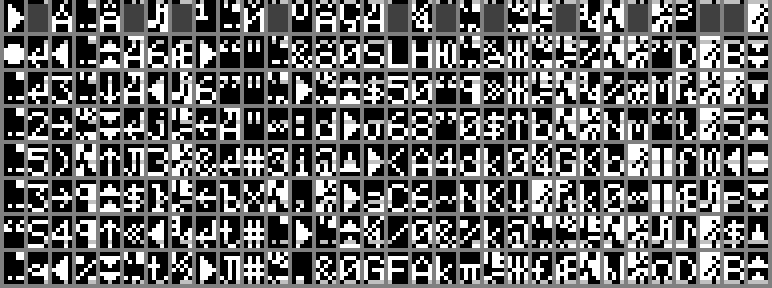
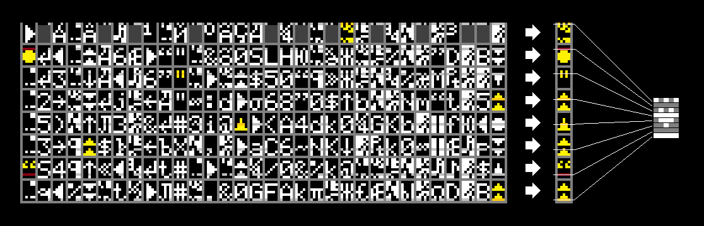

## Towards An HD44780-Based Video Mode

The following documentation describes a potential way to drive HD44780-style 16x2 character LCDs in graphics mode by using a synchronized updating scheme and complementary special characters. 
This concept introduced here can be combined with minimal hardware modifications to re-purpose 20x4 character LCDs as graphic displays.

---

#### HD44780 background

Character LCDs used in industrial machinery, test equipment and hobby projects are popular, long-lived and mostly based on [Hitachi HD44780](https://en.wikipedia.org/wiki/Hitachi_HD44780_LCD_controller)-style controllers (+ drivers) from multiple manufacturers:

* Hitachi HD44780 (+ HD44100H) 
* Sitronix ST7066U (+ ST7065C), ST0066, ST7070
* Sunplus SPLC870D (+ SPLC100A1)
* NXP PCF2119x
* ...

With minor but not necessarily documented variations, their block diagram contains 

* a 6800-style parallel interface
* character generator memories (CGROM, CGRAM)
* display data RAM (DDRAM) 
* timing generator and counters
* pixel line serializer (40 bit oriented for 8 lines by 5 pixels)
* COM and SEG drivers with 4 to 5 voltage levels
* CL1, CL2, D and M lines for external drivers.

The display panel is organized in rows driven by the controller COMs, while columns are driven by controller or auxiliary driver SEG lines. 

The driving scheme for passive matrix displays depends on the arrangement of character groups and format (e.g. 5x8, 5x10, 5x11), but is most often seen to be 1:16-multiplexed with 1/5 level bias.

The 1:2 multiplex scheme below (taken from the NXP PCF2119 datasheet) conveys the idea in a more accessible fashion. [STN](http://dx.doi.org/10.1146/annurev.matsci.27.1.555) pixels at the junction of row and column conductor stripes see a differential AC waveform. Small amplitudes don't cause a pixel to switch, and in this case, pairs of frames must be generated complementarily to create a zero time average (no DC component).

With this in mind, the timing for a display with 1:16 multiplexing and 1/5 bias can be understood as cycling through all 16 rows, where only the first time slot associated with COM1 has the high levels contributing to cell switching.

Although HD44780-like controllers have an 8 bit parallel interface, the instruction decoding and memory access logic appears to be such that one command takes at least 37 µs at 270 kHz nominal clock speed, or 10 clock cycles. The write cursor (pointer) is post-incremented when a write command is performed, so at least one address update needs to precede or follow a burst write operation. Writing 16 consecutive characters costs a minimum of 170 clocks. Filling an 8x2 character region costs at least 180 clocks, highlighting the limitations of what is possible within the time duration of a single-line drive phase of 200 clocks.

In terms of organization, 16x2, 20x2 and 20x4 LCDs use additional drivers to add more column lines, which follow a bias scheme like the one discussed above. The application circuit below shows the daisy-chained configuration for up to 20x4 characters:

**Note that only a 8x2 character block is driven by the controller itself. Pixel data for all remaining characters is transferred to daisychained driver ICs via a 3-wire synchronous serial interface.
This will be used later by inserting a resistor into the data (D) line from the controller to the first driver. A GPIO pin connected after the resistor is used for bi-directional interaction. Display controllers use a resistor-programmed internal oscillator, and injected data is synchronized to CL1, CL2 or M.**
This only leaves the characters directly driven by the controller to be taken over for graphic display capability.

Just by looking at videos people have taken from their displays, tearing as a pre-requisite can be observed. As the bar graph is updated, blocks indicate data was updated during a frame.

(source: [youtube user 파코즈](https://www.youtube.com/channel/UC8uJZfnjwI74nmosOwyPSiA)  "16x2 LCD, VU Meter, FFT Spectrum Analyser, IR Receiver2, Thermometer")

---

### State-of-the-art character display capabilities

The 2013 [hedelmae LCD megademo 2](https://www.youtube.com/watch?v=nxFad7Rxw7Q) is among the noteworthy examples of what is possible at the time of this writing.
The appetite for graphic memory access is perhaps best visible through the widespread fascination hobbyists and demoscene people have with the measly 8 custom characters available in all controllers. This well-documented feature is used by writing character code 0x00 .. 0x07 into DDRAM. The controller then gets pixel data from CGRAM and uses it analogous to CGROM data.

All the other characters are mask-programmed into CGROM at the factory. By selecting from the display datasheet (e.g. FORDATA FDDC1604, cited below),

one of multiple font sets is selected.

Over at [https://github.com/jazz-soft/char-lcd](https://github.com/jazz-soft/char-lcd), an image with the HD44780-A02 set (European standard font) is kindly provided:

---

### LUT-based pixel data encoding

Although many controller manufacturers offer multiple CGROM variants (font sets) with special characters, there aren't 2^40 different unique ones (128 GB) to display arbitrary 5x8 pixel blocks - needless to say the 40 bit character code might as well represent the pixel information itself.

If one could swap out a character before each line were serialized and sent to the column drivers however, each of 8 horizontal lines making up a 5x8 pixel character could be loaded from one of 32 characters. This subdivides the representation of an  5x8 arbitrary pixel block into 8 consecutively selected LUT characters. The image below shows placeholders for all LUT characters. The dark gray regions are ignored, while the relevant lines are drawn in black/light gray, depicting the required bit patterns.

The LUT thus consists of 32x8 (256) character codes, many of which can be matched to the existing font set:

These are exact matches, but some pixel combinations are left out. Luckily, there are still 8 custom characters available to complement the CGROM set.
With the exception of the first LUT line, all LUT lines have <= 8 missing characters, so CGRAM codes can be inserted, and CGRAM pixels defined accordingly by copying the sought-after 5-pixel combinations to their corresponding y positions. These are the custom characters derived from the A02 font set (with some artistic license, as 5-pixel lines of the same y position are interchangeable):

The uppermost lines are chosen manually as a compromise to minimize misrepresentation errors. The improved LUT then becomes

.

The LUT generation code is written in Python and provided [here](LUT/).

---

### Example

The following LUT example depicts how 5x8 graphics content is mapped to 8 LUT characters displayed in sequence, and of which only one line is used to compose the ouput on the LCD panel. 

The order in which LUT codes need to be written to CGRAM is dictated by the ordering of COM lines to the panel. 

--- 

### Synchronization

To investigate whether there is a window of opportunity to write LUT codes into DDRAM and to reset the DDRAM cursor periodically and synchronized to the bit pattern generation, an reduced section of the functional block diagram from the  [HD44780 datasheet](datasheets/controller/HD44780.pdf) is presented below.

The functional description on p.9 gives away a few, but not all details:

* "The IR (instruction register) can only be written from the MPU.", the interface _is_ a microprocessor, apart from being _for_ a (micro)processor
* the 8 bit interface is a peripheral with buffers
* inputs are either loaded to DR or IR
* BUSY is active during execution of commands, and new instructions issued while BUSY == active are ignored
* DDRAM addresses come from the instruction decoder, not from the timing generator. The 8 bit data bus is necessarily controlled by the MPU (or instruction decoder).
* 4-bit line positions (0..7 for 5x8 characters, 0..10 for 5x11) need to come from the timing generator, as the memory outputs are only 5 bit wide towards the serializer.

#### Implications

This leads to believe that the Parallel/Serial converter unit is also buffered and in part controlled by the MPU / instruction decoder. Depending on the address counter (< 16), CGRAM 5-bit data is used instead of CGROM 5-bit data. Additionally, the order of DDRAM readout is dependent on the display layout stored in the MPU, so the MPU is continuously involved in loading DDRAM data.

**The serializer needs to be filled with fresh data for every line, as the line selection already happens during CGRAM / CGROM access and no full CGROM/CGRAM 2D image is copied.** The functional block diagram shows a 40 bit shift register connected to the serializer. Strangely, the "parallel/serial converter" has a 40 bit wide output bus, so it essentially stores the eight 5-bit values loaded from CGRAM/CGROM. 

The maximum size is 80 displayed characters, each measuring 5x8 pixels, for a total of 3200 pixels. Divide that by the maximum of 16 COM lines and each line has to have 200 pixels. This number shows up above as the "200 clocks" for which one COM line is driven in a 1:16 multiplexing scheme. So without measuring, one can derive that the serializer is clocked at the full oscillator frequency. It seems plausible that the serializer would then run continuously but only fed a part of the time when displays are smaller. 

We now also know that the MPU has 5 clock cycles to get the CGROM/CGRAM data into the parallel buffer of the parallel/serial converter, and for a 20x4 display, serializer data loading has to run continuously. 

The MPU is thus twice as fast when transferring the data as one could write it into DDRAM. Timing-wise, one needs to start writing right at or behind the internal reading address. Assuming an instruction or data write operation takes 11 clocks, 16 LUT characters + 1 instruction byte can be written and processed, unlocking 16x2 * 5*8 graphics mode. That's 80x16 (1280) pixels, give or take.

### Synchronization

Furthermore, when injecting data into the serial interface to the daisy-chained extension drivers, only 8 characters + 1 command byte need to be written, further relaxing the timing and creating leeway for "software" synchronization. The latter relies on the assumption that a DISPLAY ON/OFF command resets the row counter in the timing generator. HD44780-like controllers offer an external clock option for jitter- and drift-free operation, but adding wires for extension driver CL1, CL2, M and D lines seems a lot more useful. The timing seems to be too critical to rely on RC oscillator accuracy anyway, and even though that makes it an invasive modification, it is being rewarded with a pathway to 4x20 character graphic mode.

### Expanding to 4x20 characters with serial data

Presenting pixel data to extension drivers only, and also using them for row driving, seems to have been a product reality around 1985, as the picture below shared by [AVRFreaks user ossi](https://www.avrfreaks.net/forum/lcd-hd44100-only) evidences:

so there really should be nothing holding us back morally from modifying modern displays for pixel data injection synchronous to a clock provided by a controller.
